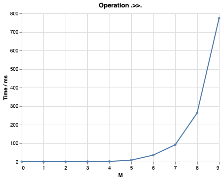
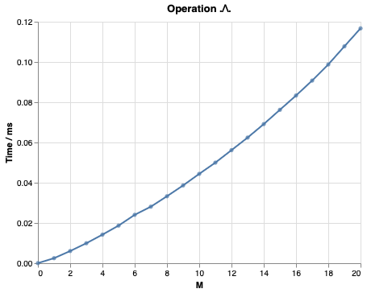
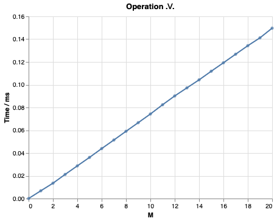
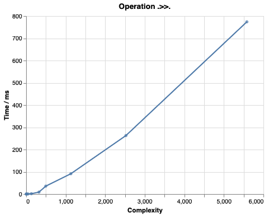
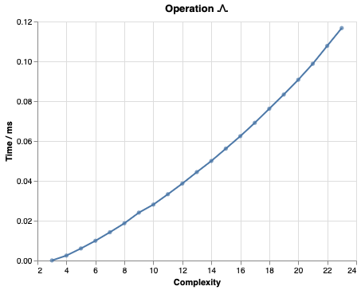
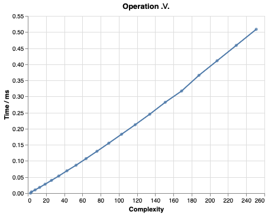

# Report on test results, coverage analysis and performance

2024-12-06  
by Predictable Network Solutions Ltd.

This report describes the current test coverage and performance measurements for the Haskell packages in this repository, which are

* `deltaq` — Haskell library that supports the ΔQ System Development paradigm.
* `probability-polynomial` — Technical enabler library for `deltaq`.

# Test results and coverage

Each package contains a test suite consisting of automated property tests.

**Test results summary:**

* The packages and its test suite use exact arithmetic (`Rational`). In principle, users have the option to use floating point arithmetic (`Double`), but we make no claims about numerical stability for such usage.

* We test > 130 properties that form a substantial subset of a complete axiomatization. No counterexamples are found.

* The enabler module `Numeric.Polynomial.Simple` that implements operations on polynomials has several outstanding issues:

    * The function `translate` fails to give correct results for some polynomials of degree `> 70`. We suspect a bug in an external implementation of binomial coefficients.
    * The function `findRoot` is unable to find the correct root in the special case where the root is precisely at the midpoint of the interval.
    * The function `isMonotonicallyIncreasingOn` is unable to handle double roots at the interval boundary. This corner case is exercised in repeated convolution of a uniform probability distribution with itself. In the `deltaq` library, this issues affects the conversion of a measure to a probability distribution; we provide a workaround `unsafeFromPositiveMeasure`.

The test suite has been analyzed for program coverage using [hpc](https://downloads.haskell.org/ghc/latest/docs/users_guide/profiling.html#observing-code-coverage). A detailed program coverage report can be found at [this URL](https://github.com/DeltaQ-SD/dq-revamp/tree/a1ac684513a6d845f6961c0feb4fadf09de53c26/hpc) and in the [supplement](artefact-A2-supplement/hpc-a1ac684513a6d845f6961c0feb4fadf09de53c26.zip).

**Test program coverage summary:**

* All relevant top-level functions are exercised in tests.
* Boilperplate derived instances such as `Show` are not exercised.
* Some boolean conditions are not exercised. We do not believe that these can cause problems, and they can be worked around by constructing approximate values that are more complex.
* Unreachable branches are flagged as not exercised; this is expected and can be considered a false positive.

To summarize, we believe that these test results give sufficient confidence that the software produces correct results for use cases of medium to high complexity.

# Performance measurements

In order to obtain an overview of the library performance, we have created a benchmark that measures the running time of the three most common operations that library users will interact with.

Specifically, we have measured the running times of the operations `.>>.`, `.\/.`, and `./\.` from the `deltaq` package.

The benchmark constructs a value of type `DQ` by combining a list of $M$ `uniform` distributions with the given operation. The time of evaluating the `distribution` function of this value to normal form is measured. The value has been constructed such that it stress tests the computations by containing

* many pieces in piecewise functions, and
* polynomials of high degree.

**Performance results and discussion:**

First, we plot of running time against the number $M$ of applications of the operation of interest:

  * Operation `.>>.`:

      

  * Operation `./\.`:

      

  * Operation `.\/.`:

      

As we can see, sequential composition `.>>.` becomes costly very quickly as the expression size increases, wherease the operations `./\.` and `.\/.` appear to scale linearly or quadratically with the size of the expression.

However, the size of an expression is distinct from the size of the internal representation of the probability distribution. To measure this, we introduce a function `complexity` that gives the internal representation size; essentially, this internal size is the sum of the degrees of the polynomials of individual function pieces.

We plot the running time against the `complexity` of the result value for the operation of interest:

  * Operation `.>>.`:

      

  * Operation `./\.`:

      

  * Operation `.\/.`:

      

We find that the `complexity` of the result increases very quickly for the operation `.>>.`, while the increase is much more moderate for `./\.` and `.\/.`. In turn, the running time appears to scale linearly or quadratically with the `complexity`.

**Performance measurement summary:**

The performance results above are acceptable for an implementation that contains no gross performance mistakes, but does not use sophisticated algorithms.

In summary, we believe that these performane measurements give confidence that this software is suitable for interactive use of small to medium complexity; these are typical use cases.

In order to make this software suitable for uses cases of medium to high complexity, the internal representation size of probability distributions needs to be contained; this is particularly relevant for repeated application of the sequential composition operation `.>>.`. Reducing the internal representation size requires moving away from exact arithmetic towards approximate representations of functions.
